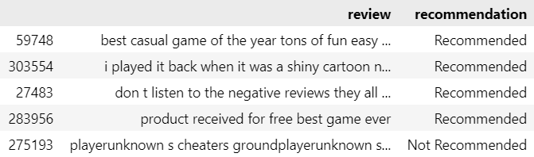

<strong>Classification of Game Review - Based on Steam Game Comments</strong>

 Yongrui Chen, Lin Meng, Haoyu Wang

 Georgetown University, Washington D.C, 20007, U.S.A

# Introduction 
With the development of computer science technology and the world economy, the game industry experienced an exploding increase in recent years. Predicted by a top consulting agency, the annual revenue of the video game industry is forecast to reach $180.1 billion in 2021. A highly increasing industry nurtured a more advanced user ecosystem. Professional video game platforms such as Steam and Xbox covered more and more market shares and gradually became the first destination for users to discover new games. 

In Steam, users give comments on games, which provide a reference for other new users on game selection. To some extent, the game review is a major factor affecting game sales. Interpreting the sentiment of game reviews becomes important, e.g., if the review content shows the recommendation or not? In this research, a review sentiment recognition system is created based on NLP (Natural Language Processing) methods such as BERT(Bidirectional Encoder Representations from Transformers), Logistics, Naive Bayes, linear SVC (linear support vector machine), Decision Tree algorithm. A python package is created for recognizing whether the given review input is recommendation or not.

# Project Methodology

## Data Cleaning & Exploratory data analysis(EDA)
The dataset used in the research is from the Steam game reviews which has more than 330 thousand rows. After checking out the basic layout of the dataset, a preprocess function is created to regularly express the review content. The characters except for the alphabet and multiple spaces are replaced. All letters are converted to lowercase. In table 1, it  shows the introduction of all the variables in the data. Also,  there is a small sample of data in figure 1.

  

To figure out the meaningless reviews, a histogram of text length is created. From figure 2 the distribution of review length, it shows there are many reviews under 5 words, which are not long enough to convey sentiments. Hence, only the reviews with more than 5 words will be used in the following analysis.